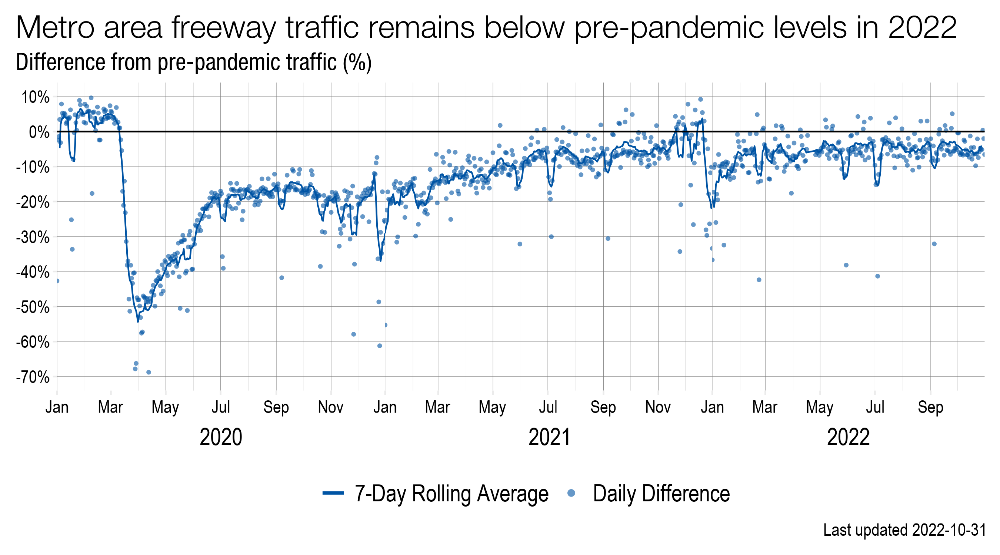

## Metro Freeway Travel Trends

Metropolitan Council researchers have developed an interactive tool that
allows users to explore traffic count trends on Twin Cities metro area
freeway system. Trends are compared to a historic, pre-pandemic
baseline. Users can view daily and hourly trends at more than 2,000
individual traffic monitoring stations or view summarized trends for
freeway corridors and the entire metropolitan area.

*A line graph of traffic volumes relative to typical traffic (the
horizontal line at zero). The blue line shows traffic trends for the
metro area freeway system. Metro area freeway traffic was down as much
as 70% during the stay-at-home order (gray rectangle) but rebounded
steadily over time.*

Met Council researchers used a modeling approach that relies on
historical traffic data from January 2018 - March 2020 to estimate
typical travel. Freeway traffic was almost 70% below typical levels
early in the pandemic, but gradually rose over the course of the year.
By the middle of 2021, total freeway traffic counts were nearing typical
levels – and in some places on the freeway system, traffic was even
greater than expected.

### What this tool can do

This tool can be used to view broad traffic trends across the Twin
Cities freeway network. Trends are summarized at varying time scales
(daily, day part, hourly) and three different levels of geography
(station, corridor, and system).

Station-level trends: This is the most detailed level of spatial
grouping in our tool. A “station” is usually a group of 2-4 sensors that
count traffic across each lane of the freeway. Station-level trends are
available at daily and day part (morning peak, mid-day, evening peak)
time scales.

Corridor-level trends: Corridors are groups of stations along a freeway
(e.g., I-494). Corridor-level trends are available at the hourly level,
for each hour of the day. System-level trends: The freeway system
represents all available stations in the MnDOT freeway sensor network.
System-level trends are available at daily level and by day part
(morning peak, mid-day, and evening peak).

### What this tool cannot do

These data become less trustworthy, and more sensitive to sensor
malfunction and other sources of error, at finer time scales and smaller
geographies. Users should use caution when drawing conclusions from
individual stations represented on the map and reach out to our data
team with questions.

### Data sources

Traffic count data are provided by the Minnesota Department of
Transportation (MnDOT). MnDOT maintains a network of sensors at
approximately half-mile increments on every lane, exit ramp and entry
ramp across the metro area freeway system. These sensors are a mix of
simple magnetic field “loop” detectors and more sophisticated
Weigh-in-Motion (WIM) sensors.

MnDOT serves data at thirty-second increments, which is more detail than
is needed for trend analysis. Council researchers process the raw data
feeds, aggregate data to fifteen-minute increments, and perform several
quality checks using their open-source R package,
[tc.sensors](https://github.com/Metropolitan-Council/tc.sensors). These
cleaned, fifteen-minute data are stored in a council-maintained
database.

To make the data useful to those most interested in regional and
long-term trends, council researchers aggregate the data from multiple
sensors (lanes) to the station-level and roll up to the hourly and daily
level. Read more about the traffic monitoring system maintained by MnDOT
[here](https://www.dot.state.mn.us/roadway/data/index.html).

### Data analysis

To estimate typical traffic in a way that is robust to weekly and
seasonal fluctuations in travel, we used statistical modeling that
relies on pre-pandemic traffic count data from January 2018 to March 1,
2020. The model relies on generalized additive models, or GAMs. GAMs are
commonly used to analyze data with a strong seasonal or cyclical trend –
especially when that trend does not follow a straight line. Some GAMs
that people might already be familiar with are those that climate
scientists use to estimate temperature trends within and across years.

The Council’s traffic trend GAMs consider three trends. One trend
happens over the span of a year: in most places, travel increases in the
summer months and decreases in the winter months. A second trend occurs
over the span of a week: travel tends to be highest on Fridays, and
lowest on Sundays. Finally, for hourly models, we examined the
variations in traffic that happen every twenty-four hours.

*Line graphs show generalized trends at the annual, weekly and hourly
level based on January 2018-March 2020 traffic data for a subset of the
most reliable traffic stations.*

To allow the shapes of these yearly and weekly trends to vary specific
to location, we created separate models for each traffic monitoring
station – each station might be made up of multiple lanes of traffic. We
eliminated stations with poor data coverage across the historic baseline
period from our analyses. We used our GAMs to generate predictions of
expected or “typical” traffic for every station, day of the year, and
hour of the day. We then estimate the difference from expected traffic
as a percentage:

 

 

Negative values show where traffic counts are lower than expected; zero
values indicate that traffic is at typical levels; and positive values
greater than zero indicate that traffic counts are greater than
baseline. To generate system-level trend estimates, or those across an
entire corridor, we calculate the total observed and expected traffic
for all working sensors on that day.

Expressing differences from normal as a percentage, rather than in raw
numbers of vehicles, allows for more robust comparisons of traffic over
time when sensors malfunction or go offline due to construction.

#### Limitations of the tool

Because our estimates of typical traffic rely on more than two years of
data with good coverage, stations that went offline for an extended
period during the historic baseline time frame (e.g., due to
construction) will not be shown on the map. Similarly, recent road
closures and projects may not always be detected and removed by our data
quality check process. Data at the individual station level is less
reliable than data at the whole-system or corridor level. Data errors
can be reported to [Ashley Asmus](mailto:ashley.asmus@metc.state.mn.us)
or by submitting an issue to our tool’s [GitHub
page](https://github.com/Metropolitan-Council/loop-sensor-trends).

Additionally, our GAMs do not account for holidays, special events or
weather – except where they might have a strong effect on seasonal
traffic trends (e.g., lower travel in the winter due to poorer driving
conditions). Daily trend results should be considered with this in mind.
Future iterations of the GAM models may account for these extra-seasonal
effects.

### Effects of COVID-19 on Freeway Travel

Our analysis of traffic data during the COVID-19 Pandemic showed that
Minnesotans reduced their travel rapidly in the days following the first
COVID-19 case in Minnesota, with a slow and steady rebound to
near-typical levels by the following year. This graph shows the daily
relative decrease in travel over time across the Twin Cities’ metro area
freeways (blue dots and lines) and on traffic sensors placed primarily
outside the metro area (black dots and lines) for the period between
March 1, 2020 and March 1, 2021. Points that fall below the zero-line
represent decreases in travel relative to typical travel on that day of
the year and day of the week.

*A line graph of traffic volumes relative to typical traffic (the
horizontal line at zero). The blue line shows traffic trends for the
metro area freeway system. The black line shows traffic trends on the
MnDOT Automated Traffic Recorder System. Metro area traffic was
consistently more reduced than statewide averages throughout the
COVID-19 Pandemic.*  

In the two weeks before the stay-at-home order was put in place on March
28, traffic volumes plummeted. Travel across the region’s freeways
declined by up to 70% in mid-March 2020. By the time the stay-at-home
order was lifted on May 18, 2020, freeway traffic was only 32% below
typical levels.

Data also show how weather plays a part in residents’ decision whether
to travel, especially on weekends. This is most clear on April 27, 2020
when an Easter Sunday snowstorm dropped traffic 71%, lower even than
when the Governor issued the stay-at-home order. Heavy rain has had a
similar effect as seen on May 17 when a spring storm dumped over two
inches of rain in the metro area.

### Contributors

-   Liz Roten, app development (Metropolitan Council)  
-   Ashley Asmus, data and model development (Metropolitan Council)  
-   Brian Kary, data development and ongoing consultation (MnDOT)  
-   Ian Vaagenes, data and model development (MnDOT)  
-   Jonathan Ehrlich, project management (Metropolitan Council)

### Contact

Email [Ashley Asmus](mailto:ashley.asmus@metc.state.mn.us)

For app bug reports and new feature requests, feel free to open an Issue
on our [GitHub
page](https://github.com/Metropolitan-Council/loop-sensor-trends).

<right style="font-size: 1rem; text-align: right; display: block;">
*Last updated 2022-01-06*  
Build ID: 2022-01-06.roten.cca5fb8f  
</right>
